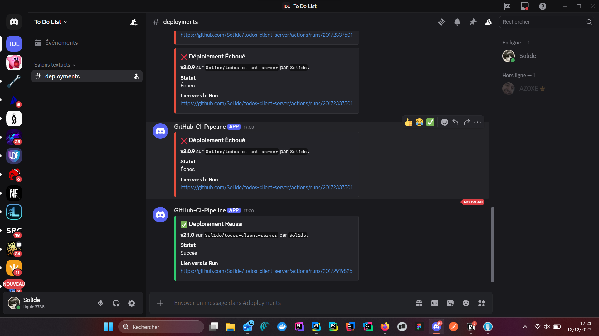

# Todo List - Application Full-Stack avec CI/CD

Application Todo List complète (client + serveur) avec une pipeline CI/CD automatisée sur GitHub Actions.

## Membres du groupe

| NOM     | Prenom     |
|---------|------------|
| DELMAS  | Olivier    |
| DAGUET  | Romain     |
| COUSIN  | Anguerrand |

## URLs de Production

| Service  | URL                                                |
|----------|----------------------------------------------------|
| Frontend | https://todos-client-server-delta.vercel.app/      |
| Backend  | https://react-nginx-5nkm.onrender.com/             |

## Architecture de la pipeline

### Structure CI/CD

```
todos-client-server/
├── .github/workflows/
│   ├── ci.yml           # Pipeline d'intégration continue
│   └── cd.yml           # Pipeline de déploiement continu
└── Dockerfile           # Image Docker multi-stage
```

### Backend (packages/server)

- **Deploiement** : Render
- **Port** : 3001
- **Endpoints API** :

| Methode | Endpoint        | Description              |
|---------|-----------------|--------------------------|
| GET     | /api/todos      | Liste toutes les todos   |
| POST    | /api/todos      | Cree une todo            |
| PATCH   | /api/todos/:id  | Toggle completion        |
| DELETE  | /api/todos/:id  | Supprime une todo        |
| GET     | /health         | Health check             |

### Frontend (packages/client)

- **Port de dev** : 5173
- **Deploiement** : Vercel

## Pipeline CI/CD

### Vue d'ensemble

La pipeline est divisee en deux workflows :
- **CI (ci.yml)** : Integration continue sur toutes les branches et PRs
- **CD (cd.yml)** : Deploiement continu declenche uniquement sur les tags `v*`

### Workflow CI (Integration Continue)

```
┌─────────┐
│ install │
└────┬────┘
     │
     ├──────────────┬──────────────┐
     ▼              ▼              ▼
┌───────────┐ ┌──────────┐ ┌─────────────────┐
│ test-unit │ │  build   │ │  lint-commits   │
└─────┬─────┘ └────┬─────┘ │   (PR only)     │
      │            │       └─────────────────┘
      ▼            │
┌──────────┐       │
│ coverage │       │
│ (PR only)│       │
└──────────┘       │
                   ▼
           ┌──────────────┐     ┌────────────────────┐
           │ build-docker │────►│ security-scan-npm  │
           │  (PR only)   │     │     (PR only)      │
           └──────┬───────┘     └────────────────────┘
                  │
                  ▼
           ┌────────────────────┐
           │ security-scan-docker│
           │     (PR only)       │
           └─────────────────────┘
```

#### Jobs CI

| Job                   | Description                                           | Declencheur    |
|-----------------------|-------------------------------------------------------|----------------|
| `install`             | Installation des dependances + cache                  | Toujours       |
| `test-unit`           | Tests unitaires avec generation de coverage           | Toujours       |
| `lint-commits`        | Validation Conventional Commits                       | PR uniquement  |
| `coverage`            | Verification du seuil de couverture (50%)             | PR uniquement  |
| `build`               | Compilation TypeScript                                | Toujours       |
| `build-docker`        | Construction image Docker (sans push)                 | PR uniquement  |
| `security-scan-npm`   | `npm audit --audit-level=high` (client + server)      | PR uniquement  |
| `security-scan-docker`| Scan Trivy pour vulnerabilites critiques              | PR uniquement  |

### Workflow CD (Deploiement Continu)

```
Declencheur: push tag v*

┌──────────────┐
│ build-docker │ ──► Push vers Docker Hub (s0lide/react-nginx:vX.X.X)
└──────┬───────┘
       │
       ├────────────────────┐
       ▼                    ▼
┌─────────────────┐  ┌──────────────────┐
│ deploy-frontend │  │  deploy-backend  │
│    (Vercel)     │  │    (Render)      │
└────────┬────────┘  └────────┬─────────┘
         │                    │
         └──────────┬─────────┘
                    ▼
            ┌──────────────┐
            │  smoke-test  │
            └──────┬───────┘
                   │
                   ▼
            ┌──────────────┐
            │    notify    │
            │  (Discord)   │
            └──────────────┘
```

#### Jobs CD

| Job               | Description                                      |
|-------------------|--------------------------------------------------|
| `build-docker`    | Build + push image Docker Hub avec tag version   |
| `deploy-frontend` | Deploiement client sur Vercel                    |
| `deploy-backend`  | Deploiement backend sur Render via deploy hook   |
| `smoke-test`      | Tests de fumee (health check + verification HTML)|
| `notify`          | Notification Discord (succes ou echec)           |

### Dockerfile Multi-Stage

Le Dockerfile utilise une approche multi-stage pour optimiser la taille de l'image :

```dockerfile
# Stage 1: Builder
FROM node:24 AS builder
# Installation des dependances et compilation TypeScript

# Stage 2: Runner
FROM node:24-alpine AS runner
# Copie uniquement du build et des dependances de production
# Image finale legere (~150MB vs ~1GB)
```

### Secrets GitHub Requis

| Secret                   | Description                            |
|--------------------------|----------------------------------------|
| `DOCKERHUB_USERNAME`     | Username Docker Hub                    |
| `DOCKERHUB_TOKEN`        | Token d'acces Docker Hub               |
| `DOCKERHUB_PROJECT_NAME` | Nom du projet Docker Hub               |
| `VERCEL_TOKEN`           | Token API Vercel                       |
| `VERCEL_ORG_ID`          | ID de l'organisation Vercel            |
| `VERCEL_PROJECT_ID`      | ID du projet Vercel                    |
| `VITE_API_URL`           | URL de l'API backend pour le client    |
| `RENDER_DEPLOY_HOOK`     | URL du webhook de deploiement Render   |
| `BACKEND_URL`            | URL du backend pour smoke tests        |
| `FRONTEND_URL`           | URL du frontend pour smoke tests       |
| `DISCORD_WEBHOOK_URL`    | URL du webhook Discord                 |

## Notifications Discord

La pipeline envoie des notifications sur Discord pour chaque deploiement :
- **Succes** : Message vert avec lien vers le run
- **Echec** : Message rouge avec lien vers le run



## Observabilite - Sentry

> **Note** : L'integration Sentry n'a pas ete finalisee pour ce projet.

## Strategie de Rollback

### Comment effectuer un rollback ?

Grace au tagging semantique des images Docker, le rollback est simple et rapide :

#### 1. Identifier la version stable

```bash
# Lister les tags disponibles sur Docker Hub
docker search s0lide/react-nginx --format "{{.Name}}"
# Ou via l'interface Docker Hub
```

#### 2. Rollback via Render

**Option A - Redéployer une version précédente :**
1. Aller sur le dashboard Render
2. Selectionner le service backend
3. Dans "Manual Deploy", specifier l'image avec le tag precedent :
   ```
   s0lide/react-nginx:v1.0.1
   ```

**Option B - Creer un nouveau tag pointant vers l'ancienne version :**
```bash
# Retagger une ancienne version
docker pull s0lide/react-nginx:v1.0.1
docker tag s0lide/react-nginx:v1.0.1 s0lide/react-nginx:v1.0.3-rollback
docker push s0lide/react-nginx:v1.0.3-rollback

# Ou simplement creer un nouveau tag Git
git tag v1.0.3-rollback v1.0.1
git push origin v1.0.3-rollback
```

#### 3. Rollback du Frontend (Vercel)

1. Aller sur le dashboard Vercel
2. Selectionner le projet
3. Aller dans "Deployments"
4. Cliquer sur les "..." du deploiement souhaite
5. Selectionner "Promote to Production"

### Avantages de cette strategie

- **Tracabilite** : Chaque version deployee est taguee et conservee
- **Rapidite** : Rollback en quelques minutes sans rebuild
- **Securite** : Les anciennes versions restent disponibles sur Docker Hub
- **Automatisation** : Un simple `git tag` peut redeclencher un deploiement

### Exemple de scenario

```
Situation: v1.0.2 est bugguee, on veut revenir a v1.0.1

1. Sur Docker Hub, l'image s0lide/react-nginx:v1.0.1 est toujours disponible
2. Sur Render : modifier l'image source vers s0lide/react-nginx:v1.0.1
3. Le service redemarre avec la version stable
4. Temps de rollback : ~2-3 minutes
```

## Conventional Commits

Ce projet suit la convention [Conventional Commits](https://www.conventionalcommits.org/) :

```
<type>[optional scope]: <description>

Types:
- feat:     Nouvelle fonctionnalite
- fix:      Correction de bug
- docs:     Documentation
- style:    Formatage (pas de changement de code)
- refactor: Refactoring
- test:     Ajout/modification de tests
- chore:    Maintenance
```

Le job `lint-commits` verifie automatiquement le respect de cette convention sur les PRs.

## Workflow Git

1. Creer une branche depuis `main`
2. Developper et commiter en suivant les Conventional Commits
3. Ouvrir une Pull Request
4. La CI valide : tests, lint, coverage, securite
5. Apres merge, creer un tag pour deployer :
   ```bash
   git tag v1.0.0
   git push origin v1.0.0
   ```